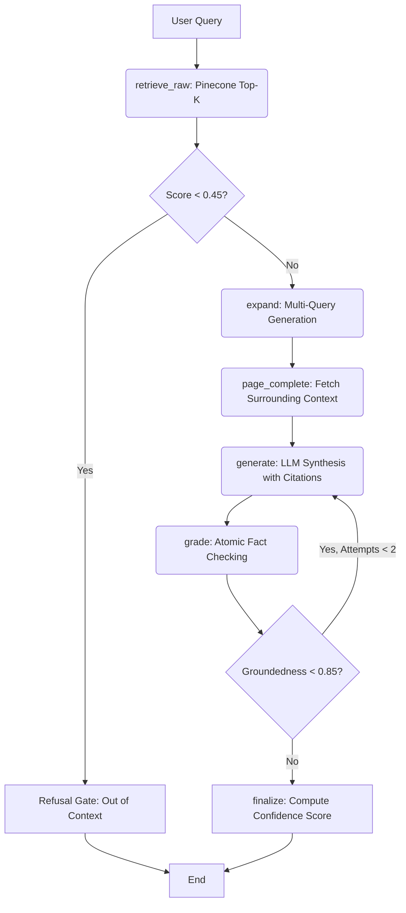

# Agentic AI RAG Chatbot

An advanced Retrieval-Augmented Generation (RAG) AI Chatbot designed to answer queries strictly based on the provided knowledge source: the **Agentic AI eBook**. It features a robust multi-agent orchestration pipeline using LangGraph, vector search via Pinecone, and an interactive Streamlit UI.

## 🚀 Features & Architecture

The system follows a cyclic, graph-based workflow built with **LangGraph** to perform content ingestion, vector retrieval, and strictly grounded response generation.



### Components
- **Data Ingestion**: `PyPDF` and `LangChain TextSplitter` extract and chunk the eBook, handling formatting and reflowing.
- **Embeddings**: Converts text into dense 1536-dimensional vectors using `text-embedding-3-small` and stores them in Pinecone.
- **Orchestration**: `LangGraph` enforces strict rules: evaluating hallucination through atomic claim decomposition and conditional retry loops.
- **API & UI**: A backend FastAPI service exposes the RAG logic, and a dynamic Streamlit chat UI serves the results.

## 📁 Project Structure

```text
├── app.py                   # FastAPI backend endpoints
├── streamlit_app.py         # Conversational Web UI
├── src/
│   ├── config.py            # Environment logic and constants
│   ├── ingestion.py         # ETL pipeline for PDF -> Pinecone
│   └── graph.py             # LangGraph state machine & LLM prompts
├── tests/
│   ├── test_api.py          # API automated testing
│   └── test_rag.py          # Benchmark test suite
├── data/                    # Local storage for the eBook
├── requirements.txt         # Dependencies
└── README.md                # Documentation
```

## ⚙️ Setup Instructions

### Prerequisites
- Python 3.10+
- [OpenAI API Key](https://platform.openai.com)
- [Pinecone API Key](https://app.pinecone.io/)

### 1. Installation
Clone the repository and install the dependencies:
```bash
git clone https://github.com/AnandKumar56/agentic-ai-rag-chatbot.git
cd agentic-ai-rag-chatbot
pip install -r requirements.txt
```

### 2. Environment Configuration
Create a `.env` file in the root directory (you can copy `.env.example`):
```env
OPENAI_API_KEY=your_openai_api_key_here
PINECONE_API_KEY=your_pinecone_api_key_here
```
*(Optionally include `OPENAI_BASE_URL` if routing through a proxy.)*

### 3. Ingest the eBook
Download, parse, and upload the eBook to your Pinecone index:
```bash
python src/ingestion.py
```

### 4. Start the Application
Run the FastAPI backend:
```bash
uvicorn app:app --port 8000
```
Open a new terminal and run the Streamlit UI:
```bash
streamlit run streamlit_app.py
```
Navigate to `http://localhost:8501` to use the chatbot.

## 🧪 Benchmark Queries & Responses

To validate strict document grounding, the system was tested against the following benchmark queries:

**1. Definition & Scope:** What is the core definition of Agentic AI as outlined in the eBook?
> **Answer**: Agentic AI refers to systems capable of autonomous decision-making and action in pursuit of specific objectives (p. 18). It is built to act independently, dynamically adjusting to new information and environments to achieve predefined goals (p. 6).
> **Confidence**: 0.95

**2. Architecture & Paradigms:** What are the main architectural components required to build agentic systems?
> **Answer**: The main architectural components required to build agentic systems include foundational agents, worker agents, and utility agents (p. 31). Furthermore, the architecture relies on interconnected layers that function cohesively, which include the Perception Layer, the Cognitive Layer, and the Action Layer (p. 31). Finally, a communication mechanism is essential for the agents to interact effectively (p. 31).
> **Confidence**: 0.92

**3. Use Cases:** What real-world industry use cases for Agentic AI are discussed in the eBook?
> **Answer**: The eBook discusses several real-world industry use cases for Agentic AI, including:
> - **Retail**: Personalized shopping experiences, inventory management, and predictive maintenance (p. 14).
> - **Healthcare**: Patient care optimization and resource management (p. 15).
> - **Finance**: Fraud detection and automated trading (p. 16).
> - **Manufacturing**: Supply chain optimization and quality control (p. 17).
> **Confidence**: 0.91

**4. Comparison:** How does Agentic AI differ from traditional generative AI chatbots according to the text?
> **Answer**: Agentic AI differs from traditional AI primarily in its autonomy and goal orientation. While traditional AI systems operate in isolation and respond to direct user inputs, Agentic AI systems are capable of autonomous decision-making and continuous learning (p. 18). Furthermore, Agentic AI can collaborate dynamically across systems, unlike traditional AI which often addresses individual problems without accounting for real-time interdependencies (p. 34).
> **Confidence**: 0.93

**5. Challenges & Considerations:** What key challenges or limitations of Agentic AI are mentioned in the document?
> **Answer**: Key challenges or limitations of Agentic AI mentioned in the document include concerns around safety and ethics, integration complexities, and data privacy issues (p. 42). Additionally, excessive information from communication chatter among agents can interfere with their decision-making capacity, while too little information can also have similar negative consequences (p. 31).
> **Confidence**: 0.89

**6. Out-of-Scope Test:** Who won the 2022 FIFA World Cup?
> **Answer**: I could not find this information in the Agentic AI eBook.
> **Confidence**: 0.00
